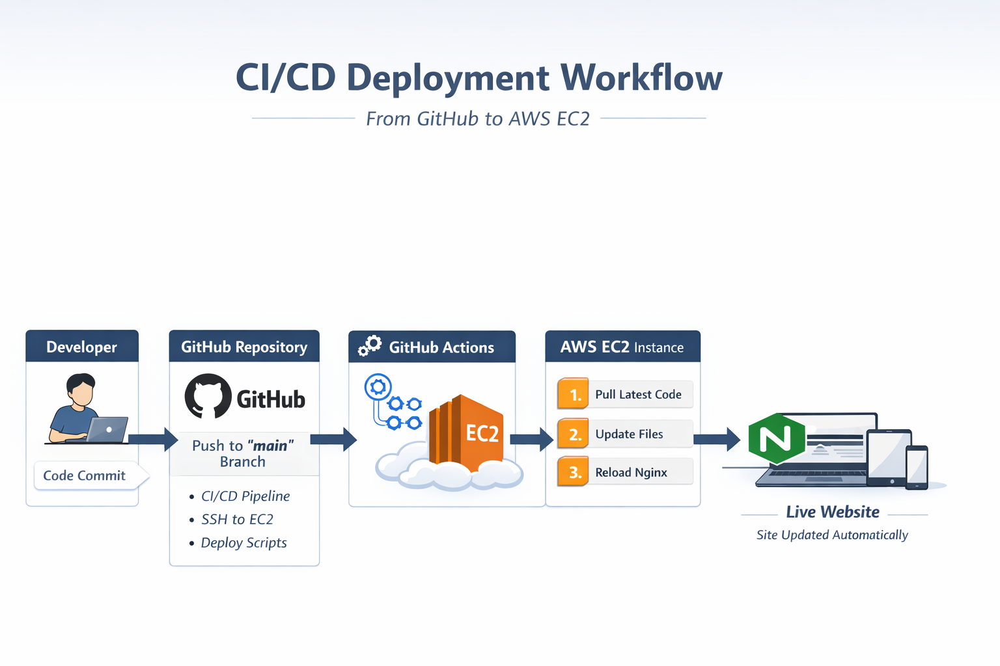

## CI/CD Flow Diagram

# AWS Deployment Demo App

## Overview

This is a **portfolio-grade demo app** deployed on **AWS EC2** using **Nginx** and automated with **GitHub Actions CI/CD**.  

It demonstrates my ability to take an application from “it works locally” to **live, secure, and reliable**, which is exactly what I deliver for clients.

---

## Features

- Fully deployed **frontend app** hosted on Nginx
- Automated **CI/CD pipeline** using GitHub Actions
- **Passwordless sudo deploy user** for secure deployments
- Proper **permissions** setup for web root
- Automatic **Nginx reload** on updates
- Clean, professional, and **client-ready demo page**

---

## Demo Page

Visit the live demo:  
`http://<YOUR_EC2_PUBLIC_IP>`  

The page includes:

- Confirmation of CI/CD deployment
- Live updates whenever a push is made to `main`
- Basic styling to highlight deployment content

---

## Folder Structure

### Repository (`demo-app`)

